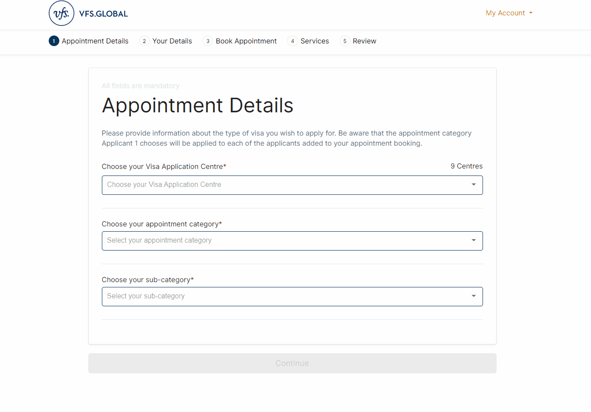

# js scripts for https://visa.vfsglobal.com:
1. automatically checking VISA available appointment time.
1. automatically fill applicants information to save your time to claim the available slot.

> now this repo is a part of https://github.com/metasong/jsKit/tree/main/src/tools/vfsGlobal

> ATTENTION:
>
> The author here just shares the tools on researching purposes,
> Using of this Script Is fully under Your Own Responsibility

## automatically checking VISA available appointment time
> It will play sound when finding available appointment
> Note: don't forget to config the 'subCategoryIndex' before running the script autoCheckingAppointment.js



```javascript
////////////////////////////////----DESCRIPTION----/////////////////////////////////////////////
// auto checking appointment availability at https://visa.vfsglobal.com/usa/en/fra/application-detail
// play sound to notify you when slot available.
//
// manually filled info by your self: Visa Application Centre; appointment category.
// this script will automatically select the 'sub-category' selector (the last one) to trigger the time slot query.
//
///////////////////////////////////---USAGE-----////////////////////////////////////////////////
// when your are on page: https://visa.vfsglobal.com/usa/en/fra/application-detail
// open devtools window of the page: F12 or right click and select 'inspect', switch to the 'Console' tab of the devtools
// paste the whole code and click 'enter' to run
// Note:
// you can call beep() in console to check whether you volume is good enough for notification
// you can always call 'sp()' anytime in console to stop checking.
//
////////////////////////////////////----CONFIG----///////////////////////////////////////////////
// please config: 'sub-category' index for your appointment!!!!!!!!
//
// i.e. for 'Long Stay (> 90 days)' category,
// sub-category index 0: 'Long Stay - Any other visa category'
// sub-category index 1: 'Long Stay Spouse of French Citizen, family member of EU national, spouse of Swiss national'
var subCategoryIndex = 0; // start from 0

// you can configure the query interval, but make sure you are not too frequent, otherwise you will be blocked.
// the CycliclyCheckingInterval = interval + random{0 to 1} * intervalVariation
var interval = 60 * 2; //seconds
var intervalVariation = 60; //seconds
```

## automatically fill applicants information to save your time to claim the available slot

> modify the applicants information before running the script autoFillApplicantInfo.js


```javascript
// autofill information for VISA applicants at https://visa.vfsglobal.com/usa/en/fra/your-details
// it supports filling multiple applications together
// /////////////////////////////////---USAGE-----////////////////////////////////////////////////
// when your are on page: https://visa.vfsglobal.com/usa/en/fra/your-details
// open devtools window of the page: F12 or right click and select 'inspect', switch to the 'Console' tab of the devtools
// paste the whole code and click 'enter' to run
// ------------
// Note:
// after adding anther applicant, we need to manually run the below line in console to input the second application information
inputInfo(info[1]);

// the third application information
// inputInfo(info[2]);
// -------------
```
